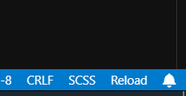

# Reload Editor

A simple extension that adds a reload button to the status bar of the Editor, allowing you to quickly reload the window when needed.

## ✨ Features

- **Reload Button**: Adds a reload button to the status bar (bottom right corner)
- **Quick Access**: Allows you to reload the Editor window with a single click
- **Informative Tooltip**: Shows "Reload window" when hovering over the button
- **Automatic Activation**: Loads automatically when the editor starts

## 🚀 How to Use

1. Install the extension in the Editor
2. The reload button will appear automatically in the status bar
3. Click the button to reload the Editor window

## 📋 Requirements

- Cursor Editor
- VS Code Engine ^1.74.0

## 📝 Changelog

### 0.0.1
- Initial version
- Reload button in status bar
- Integration with `workbench.action.reloadWindow` command
- Automatic extension activation
- Custom icon

## 🤝 Contributing

Contributions are welcome! Feel free to:

1. Fork the project
2. Create a branch for your feature (`git checkout -b feature/new-feature`)
3. Commit your changes (`git commit -m 'Add new feature'`)
4. Push to the branch (`git push origin feature/new-feature`)
5. Open a Pull Request

## 📄 License

This project is under the MIT license. See the [LICENSE](LICENSE) file for more details.

## 🙏 Credits

This extension was inspired and based on the [reload](https://github.com/natqe/reload) project by [@natqe](https://github.com/natqe), a similar extension for VS Code. We thank the original author for the inspiration and excellent work!

**Original Project**: [natqe/reload](https://github.com/natqe/reload) - Reload extension for VS Code

## 📞 Support

- **Issues**: [GitHub Issues](https://github.com/dirsouza/reload-plugin/issues)
- **Homepage**: [GitHub Repository](https://github.com/dirsouza/reload-plugin)

## ⭐ Support

If this extension was useful to you, consider giving a star to the repository! ⭐

---

**Developed with ❤️ for the community by [@dirsouza](https://github.com/dirsouza)**